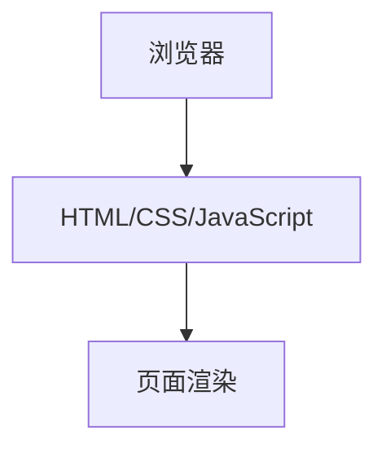

## 1. Architecture Design
纯前端应用，无需后端服务。

## 2. Technology Description
- 前端：HTML5 + CSS3 + JavaScript
- 无后端服务
- 无数据库需求

## 3. Route Definitions
| Route | Purpose |
|-------|---------|
| /index.html | 首页，仓库介绍和内容展示 |

## 4. API Definitions
不需要API

## 5. Server Architecture Diagram
不需要后端服务

## 6. Data Model
不需要数据模型
