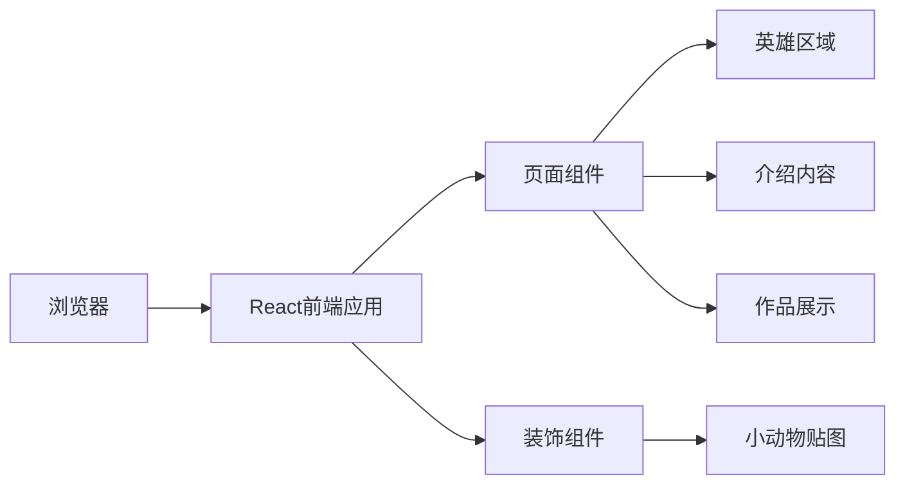

## 1. Architecture Design
单页静态网站架构，使用React + Vite + Tailwind CSS构建，无需后端服务。

## 2. Technology Description
- 前端: React@18 + TypeScript + tailwindcss@3 + Vite
- 初始化工具: vite-init
- 后端: 无（纯静态网站）
- 数据库: 无

## 3. Route Definitions
| Route | Purpose |
|-------|---------|
| / | 首页 - 展示所有内容 |

## 4. API Definitions
本项目无后端API

## 5. Server Architecture Diagram
本项目无后端服务器

## 6. Data Model
本项目无数据库
